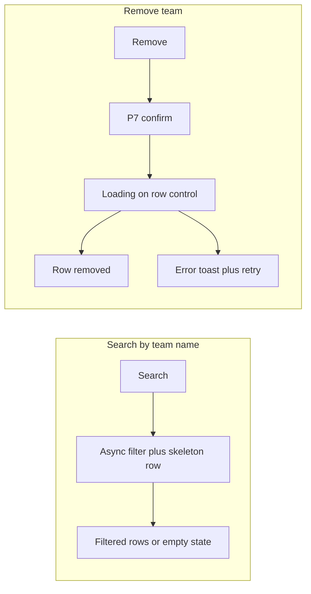

# UX Patterns — interaction & flow rules

> This file is the **human-readable** interaction rulebook for Transformers interfaces.
> It describes **behaviour** — how interfaces flow, validate, confirm, and
> sequence. The P1–P10 patterns here apply regardless of design system, though
> examples use lo-fi vocabulary.
>
> For **components** — what to render and how to compose them — read
> [`LOFI_KIT_PATTERNS.md`](LOFI_KIT_PATTERNS.md) and [`LOFI_BLOCKS.md`](LOFI_BLOCKS.md).
>
> An interface that uses the right components but ignores these flow rules will look correct and behave wrong.

---

## Patterns

Each pattern below is a reusable behaviour. Combine them to build flows.

Patterns are ordered from **structural / shell** patterns to **interaction / primitive** patterns, reflecting the way an interface is understood — outer frame first, then the behaviours inside it.

---

### P1: Workspace (Unified Production Landscape)

The structural shell of a UPL interface. "Workspace" here means the complete
operator environment — the containing frame and its sub-regions. This is not
to be confused with a browser window; the term describes the product concept only.

All Workspace interfaces begin with the **UPL Shell** (§ 1.1). What appears
beneath it depends on the interface, but the hierarchy from the spec always
holds: shell → filter → sidebar → main interface.

**Base layout (ultra-low-fi view — outer regions before components):**

```
┌─────────────────────────────────────────────────────────────────┐
│  [logo] Interface name                   [Apps][Config] j.smith  │  ← 1.1  upper bar (always visible)
├─────────────────────────────────────────────────────────────────┤
│  [ Tab A ] [ Tab B ] [ Tab C ]                                   │  ← 1.1  module strip (optional)
├─────────────────────────────────────────────────────────────────┤
│  Sport ▾  Category ▾  [...........]  [Search]  [Clear all]      │  ← 1.2.1 filter row
├──────────────────┬──────────────────────────────────────────────┤
│ /  Soccer        │ ■■ Breadcrumb › Path                  [Save] │  ← 1.2.2 sidebar  /  1.2.3 main interface view
│ /    · Intl Clubs│ ─────────────────────────────────────────── │
│ /      · UCL     │ [ Tab 1 ] [ Tab 2 ] [ Tab 3 ]               │
│ /        · KO ◀ │                                              │
│ /                │  . . . content . . .                        │
│ [◀]              │  . . .                                      │
├──────────────────┴──────────────────────────────────────────────┤
│                                     [Reset changes]  [Save changes] │  ← 1.2.3.2 sticky footer
└─────────────────────────────────────────────────────────────────┘
```

---

#### P1.1: UPL Shell

The persistent global container that frames all UPL interfaces. It is always
visible and does not collapse or change based on navigation state.

**Upper bar (always present):**

- Leftmost: company logo placeholder (bordered box, no colour, no real brand assets).
- Next to logo: interface name (e.g. "Sport Admin", "Mapping", "Resulting").
- Far right: administrative affordances — **Applications** menu, **Configuration** link, and the **user identity strip**: username in `j.smith` format, role label (Operator / Supervisor / Admin). Informational only in production. In prototypes this doubles as a **role switcher** so testers can toggle roles to exercise role-gated flows — label it clearly as prototype-only.

**Module context strip (optional, second row):**

- Present in complex interfaces that group multiple modules (e.g. Tournaments / Competitors / Venues).
- Rendered as a tab strip directly below the upper bar.
- Switching modules changes the context for the filter query row, sidebar, and main interface view.
- Not every UPL interface has a module strip; single-module interfaces omit it.

<!-- storybook:embed P1_1_UPLShell -->

---

#### P1.2: Internal Workspace

The operator's working environment below the UPL Shell. Composed of three
major interactive regions: **Filter Row** (§ 1.2.1), **Sidebar** (§ 1.2.2),
and **Main Interface View** (§ 1.2.3). Not all three are required on every
interface — layout depends on the product.

---

#### P1.2.1: Filter Row

A horizontal band of filter and search controls that manipulates the content
below it — the sidebar tree and the main interface view.

**Behaviour:**

- Filters apply AND logic across all active filter fields.
- Changing any filter updates the sidebar to show only matching entries.
- If the currently selected sidebar leaf is no longer in scope after a filter change, the main interface view clears to an appropriate empty state. The stale selection is never silently retained.
- When no filters are active, the sidebar may be empty or show top-level entries only.

**Search control:**

- Search is the most common filter input and is always visible — never hidden behind an icon or a toggle.
- Search accepts both names and IDs.
- By default, searching is triggered by a **debounce** effect (typically 300–500 ms after the user stops typing). No explicit Search button is shown in this mode.
- When the backend is specific, slow, or unstable, an explicit **Search** button replaces debounce. The filter row shows both the input and the button.

**Date / time controls:**

- Date pickers are the second most common filter type. They can represent a single date or a date range (date range picker).

**Per-field clear:**

- Every non-required filter input carries a ✕ clear control (visible when the field has a value). Clearing one field affects only that dimension; it does not reset other fields or trigger a new search.

**Clear all:**

- A **Clear all** button at the far right of the filter row resets every active filter field simultaneously and resets dependent state (sidebar tree, main interface).

<!-- storybook:embed P1_2_1_FilterRow -->

---

#### P1.2.2: Sidebar

A collapsible full-height navigation column that shows a hierarchical tree of
entities (e.g. Sports → Tournaments → Seasons). Its content is driven by the
filter query row.

**Tree and navigation:**

- Sidebar items are branch nodes (expandable) or leaf nodes (selectable).
- Selecting a leaf loads the corresponding entity into the main interface view.
- When no leaf is selected, the main interface view shows an empty state.
- Branch nodes carry a **trailing chevron** (▶ closed, ▼ open) indicating expandability.
- Branch nodes may carry a **leading icon** (optional) as a visual descriptor — e.g. a sport icon.
- Items may display a **counter badge** showing the number of child entities they contain (e.g. "12 tournaments").
- Items may include an **ID** label (e.g. "UCL 24/25 (ID 1801)") to support search and identification.

**Hierarchy level indicators:**

- Because sidebar trees can be deep, the current navigation level must always be visually communicated. Level indicators (indentation, level prefix, or breadcrumb) tell operators where they are within the hierarchy at a glance.

**Collapse:**

- An arrow button (◀) next to the sidebar collapses it. When collapsed, the main interface view expands to use the full remaining width.
- Collapse is a layout affordance only — it never triggers a confirmation, clears the selection, or resets data.
- Reopening the sidebar restores the exact same expanded/selected state.

<!-- storybook:embed P1_2_2_Sidebar -->

---

#### P1.2.3: Main Interface View

The primary editor/viewer surface of a UPL interface. It sits to the right of
the sidebar and below the filter row. Conceptually it behaves like a flat modal
dialog that occupies a persistent pane — it has no dismiss button, and its zones
do not reposition when data changes.

The main interface view has three fixed sub-zones: **Heading bar** (§ 1.2.3.1),
**Main content** (§ 1.2.3.3), and **Footer** (§ 1.2.3.2).

<!-- storybook:embed P1_2_3_MainInterface -->

---

#### P1.2.3.1: Heading Bar

The top zone of the main interface view. Always visible regardless of scroll
position within the content area.

**Content:**

- **Leading icon** (optional) — a visual descriptor for the entity type.
- **Naming element** — either a simple title or a **breadcrumb** system when the sidebar has a hierarchy (e.g. "Soccer > International Youth > U20 AFC Asian Cup. Group C. Women (ID 180564)").
- **Badges and labels** (optional) — status indicators, type tags, or other contextual metadata.

**Breadcrumb interactivity:**

- The breadcrumb can be interactive (clicking a segment navigates the sidebar to that level) when the interface supports it — for example, when multiple hierarchy levels can be shown as main interface views.
- When the feature does not support sidebar-linked navigation, the breadcrumb is non-interactive and serves as a label only.

**Save in heading (multi-pane interfaces):**

- In interfaces where multiple main interface views are visible simultaneously (e.g. "Resulting"), the primary **Save / Confirm** action is placed in the heading bar on the far right, rather than in the sticky footer.

**Collapsible heading bar:**

- In interfaces with multiple main interface views, heading bars may be individually collapsible so operators can focus on one pane at a time.

**Visual separation:**

- The heading bar is separated from the content area by a divider line or a distinct background shade.

<!-- storybook:embed P1_2_3_1_HeadingBar -->

---

#### P1.2.3.2: Footer

The sticky bottom zone of the main interface view. Always visible; scrolling
content does not move the footer.

**Actions:**

- **Reset** — reverts all unsaved edits in the current tab to the last saved state. Triggers a confirmation dialog (P7) before reverting: "Discard unsaved changes to [entity name]?"
- **Save / Confirm** — commits all changes in the current tab. Disabled when the form is not dirty or when validation fails. **Same gating as a modal** (P6 Inline Validation: blur validation, dirty check in edit mode, required fields in create flows where applicable). **No P7 before save** — the main-pane footer is an **inline workspace** commit; use **P3 (Stateful Button)** (`idle` → `loading` → `success` / error), not a confirmation dialog. **Contrast:** Save and Create from a **P5 modal** footer still require **P7** before the async operation (see **P6** — modal save path).
- **Save / Confirm** control: `LOFIStatefulButton` per **P3**; **P4** governs success/error toasts when the spec uses transient notifications; see **P6** for field rules and when the commit enables.

> In multi-pane interfaces, the Save action may appear in the heading bar (§ 1.2.3.1) instead of the footer.

<!-- storybook:embed P1_2_3_2_Footer -->

---

#### P1.2.3.3: Main Content

The scrollable body of the main interface view. This is where the bulk of the
feature interface lives.

**Internal tab navigation (optional):**

- Complex main interface views contain an additional tab strip at the top of the content area, switching between parallel content sections within the current entity (e.g. Admin / Properties / Positions / Event Types / Change log).
- Tab navigation rules follow **P8 (Tab Navigation)**: tab-local dirty state persists on switch; no discard prompt on tab change.
- The tab strip spans the full width of the content area.
- The last tab is always "Change log" when a changelog is present (append-only, read-only).

**Content types:**

- A **table** (P2 — Data Table): most common in list/management views.
- **Form fields** (text inputs, selects, checkboxes, switches, date pickers): most common in editor views.
- **Mixed** (fieldsets grouping both): common in feature admin editors (e.g. General settings + a competitor table in the same view).

**Every data mutation generates a changelog entry.** See Interaction rules § Changelog.

<!-- storybook:embed P1_2_3_3_MainContent -->

---

### P2: Data Table

> **Pattern brief:** Data tables are the primary surface for scanning, sorting, and acting on entity lists. Keep structure, row affordances, column contracts, and bulk flows predictable as data grows.

> _Docs note — hints: use **LOFIInlineAlert** (info / warning) and border tokens for secondary notes. Radix Primitives do not ship a Callout; Radix Themes Callout is chromatic and out of scope for lo-fi kit._

P2 covers the data table pattern across five sub-patterns: **P2.1** (table structure), **P2.2** (row actions), **P2.3** (column controls), **P2.4** (bulk operations), and **P2.5** (expandable rows).

---

#### P2.1: Table Structure

A table displaying rows of entity data with columns.

**Rules:**

- **Search at scale.** Tables with more than ~15 expected rows must have a persistent, visible search bar above the table. Never collapse search behind an icon-only control.
- **Search control shape.** A table toolbar always has a search input. When the search is not part of a larger filter set, the toolbar shows only: a bounded-width text field (max ~200px) with a clear affordance (✕ button active when value is non-empty) and a **Search** button immediately beside it. See the live Storybook example → **PATTERNS / UX Patterns — P2.1 Table structure** for the reference implementation.
- **Sort.** Column headers support sorting where applicable. See **P2.3** for which columns are sortable and which are not.

<!-- storybook:embed P2_1_TableStructure -->

- **Empty state.** If the table has no data, show an empty state in the table body area. Choose the variant by context:
  - `first-use` — no records exist yet. Show the stable table chrome (toolbar with controls — disabled where not actionable — plus full column headers) and an informational message explaining that nothing exists and what to do. The primary create action on the toolbar stays enabled. Do not hide the table shell.
  - `no-results` — a filter or search returned nothing. Show the table with headers and a message; provide a clear-filters action.
  - `error` — data load failed; provide a retry action.
  - The first-use chrome is a **UX skeleton** — stable layout with real headers and disabled controls. Do not use a layout-preserving skeleton placeholder (a different pattern, see Skeleton backlog) for the first-use case.

<!-- storybook:embed P2_EmptyState -->

- **Loading state.** If data is being fetched or processed, show a loading indicator inside the table body. Do not block the full page. For pagination with known totals, use page controls. For lazy/infinite scroll (when the backend cannot report the total count): show a blank loading row with a centred loading indicator at the bottom of the scroll area, signalling that more rows are being fetched. Alternatively show a "Load more" button — the choice depends on the backend and use case.

<!-- storybook:embed P2_LoadingState -->

- **Table in modal.** Tables may appear inside modals (P5) one level deep. A table inside a modal does not open another modal — the sole exception is a **confirmation-only** overlay (P7) triggered by a destructive or save action within the modal.

---

#### P2.2: Row Actions

Controls in the **Actions** column of a data table row.

**Canonical actions:** Edit, Remove, View, Hide.

**Rules:**

- **Destructive or irreversible actions** (Remove, Delete) require a confirmation dialog (P7) before executing. Use `variant="primary"` to communicate weight.
- **Reversible actions** (Hide) do **not** require confirmation — they can be undone. Use `variant="default"` (secondary/outline) to signal lower weight. When the row is hidden, the same control may switch its label to **Unhide** so the operator sees the current mode — **P3**, reversible **label-toggle** variant (prefer **`LOFIButton`** or **`LOFIStatefulButton` in `idle` only**; see **P3 Variant B**).
- Row actions that open a detail editor follow the **P5 Modal** pattern.
- Role-gated actions are **hidden** (not disabled) for unauthorised users.

<!-- storybook:embed P2_2_RowActions -->

---

#### P2.3: Table Column Controls

Behaviours that apply to specific column types in the table structure.

**Sortability:**

- **Actions** column: never sortable — there is nothing meaningful to sort.
- **Selection** columns: not sortable (see below).
- Any column where sorting provides no value (status-only, badge-only, action-cell) can be declared non-sortable; no sort indicator is shown for these columns.
- For the sort affordance (indicator states: ↑↓ idle, ↑ ascending, ↓ descending), see the live Storybook example → **PATTERNS / UX Patterns — P2.3 Sort affordance**.

<!-- storybook:embed P2_3_SortAffordance -->

**Multi-select (checkbox column):**

- When rows support multi-selection, a **Select all** master control sits in the column header.
- Each row in the column body holds a **checkbox**.
- Bulk operations on selected rows follow **P2.4**.

**Single-select (radio column):**

- When only one row may be selected at a time and a checkbox model is inappropriate, use **radio buttons** in the column body.
- The header for a radio column does not hold a sort indicator.

---

#### P2.4: Bulk Operations

Operations targeting multiple rows at once (via selection) or populating the table via external file import.

**Bulk selection:**

- Bulk destructive actions are only valid when rows are selected (using the P2.3 multi-select model). Controls for bulk destructive operations must stay disabled until a selection exists.

See the live Storybook example → **PATTERNS / UX Patterns — P2.4 Bulk hide** for the reference implementation of checkbox multi-select, per-row hide/unhide, and bulk hide. Per-row **Hide** uses **P3 (Stateful Button)** — reversible **label-toggle** variant: after hide, the control reads **Unhide** so the hidden state is obvious; no **P7** confirmation.

<!-- storybook:embed P2_4_BulkHide -->

**Bulk import (CSV or similar):**

- Provide a **Browse** button and/or a **drag-and-drop** zone. These can appear above the table.
- After external files are chosen, a **Confirm** or **Upload** action becomes enabled (exact wording per feature spec).
- While import is processing: show a loading overlay **over the table area** (not only beneath it). The overlay uses a semi-transparent white background (~10% opacity) so the table is visibly inactive and interactions are blocked until the operation completes.

<!-- storybook:embed P2_4_BulkImport -->

---

#### P2.5: Expandable rows

Use **row expansion** to reveal secondary context (detail fields, nested lists, audit notes) **inline** beneath a table row. This is the preferred alternative to opening a **second P5 modal** on top of an existing one — stacked modals (except **P7** confirmation-only overlays) remain an anti-pattern.

**Rules:**

1. **Multi-context visibility.** Expansion lets operators keep the list in view while reading detail, and compare multiple expanded rows when the product allows more than one open at a time (subject to performance and clarity).
2. **Long detail bodies.** When expanded content is taller than a comfortable viewport band, constrain the **detail body** to a scroll region with a **max-height** (viewport-relative or rem-based). **Expand and collapse** use the **parent table row only** (chevron and/or whole-row behaviour) — do **not** add a second collapse control inside the detail. While the operator scrolls, the **parent row** (all cells, including **Actions**) stays in view via **sticky** behaviour in the relevant scroll container — see **P10**. `LOFITable` with `expandable` implements this by default.
3. **Modality.** Row expansion does not replace P5 for full **create/edit** flows that need modal chrome — use expansion for **read-mostly** or **supplementary** context; open P5 when the task needs a dedicated editor surface.

<!-- storybook:embed P2_5_ExpandableRows -->

---

### P3: Stateful Button

Controls whose **label**, **visual weight**, and/or **disabled** state encode async **commit progress** or the **current reversible mode** of an action (so the operator always knows what will happen next).

**Variant A — Async commit (`LOFIStatefulButton`):**

Use for the main-workspace footer **Save** (no confirmation — **P7** does not apply) and for compact row toggles such as **Map → Mapped** (**P2.2**), often composed with a separate **Unmap** control because the `success` state is non-clickable.

- **Idle:** primary variant, labelled "Save changes" (or the row action verb) — enabled when the action is allowed (e.g. form dirty for Save).
- **Loading:** disabled; animated dots (e.g. "Saving…").
- **Success:** muted/dismiss variant (e.g. "Saved" / "Mapped"), disabled until context changes.
- **Revert-to-saved:** if the user restores field values to the last-saved snapshot, return to success without firing a new save.
- **Error:** return to idle (primary, enabled); show an **error** toast per **P4** (and keep the sticky footer until the operator saves successfully or resets). Field-level validation errors remain adjacent to controls per **P6**.

Simulate a 500ms–1.5s async delay in prototypes so loading states are visible during demos.

<!-- storybook:embed P3_StatefulButton -->

**Interactive inline save (with error path):**

The same **P3** `idle` → `loading` → `success` sequence on a field-backed form appears below under **P6** (field rules, dirty check, random failure → toast + retry). Use it when you need a full save feedback loop in Storybook, not only the static snapshots in the story above.

<!-- storybook:embed P6_InlineValidation -->

**Pattern connections**

| Pattern | Context | Rule |
|---------|---------|------|
| **P6 — Inline validation** | Field rules and save gating | Pair the Save control with inline validation; the async Save **sequence** is **P3**; outcome toasts are **P4**. |
| **P2.2 — Row actions** | Data table action column | Use `LOFIStatefulButton` (`size="compact"`) for row-level toggles (e.g. Map → Mapped). Compose with a separate `LOFIButton variant="dismiss"` for Unmap / undo when `success` is non-clickable. |
| **P5 / P7** | Modal footer save | Saves from a **P5** modal footer require **P7** before the async operation; **P3** on the commit control applies **after** confirmation, not instead of it. |

**Usage (`LOFIStatefulButton`)**

```tsx
import { LOFIStatefulButton } from 'lofi-kit';
import type { StatefulButtonState } from 'lofi-kit';

// P3 inline save
<LOFIStatefulButton
  state={btnState}
  idleLabel="Save"
  loadingLabel="Save"
  successLabel="Saved"
  variant={btnState === 'success' ? 'dismiss' : 'primary'}
  onClick={handleSave}
/>

// P2.2 row toggle + separate reverse
<LOFIStatefulButton
  state={mapState}
  idleLabel="Map"
  loadingLabel="Working"
  successLabel="Mapped"
  size="compact"
  onClick={() => startMap(row.id)}
/>
{row.status === 'mapped' && (
  <LOFIButton variant="dismiss" size="compact" onClick={() => startUnmap(row.id)}>
    Unmap
  </LOFIButton>
)}
```

- Pass **`variant` alongside `state`** — the component does not pick variant for you. Convention: `primary` for idle and loading, `dismiss` for success.
- **`loadingLabel`** is optional; when set it prefixes the animated dots (e.g. `loadingLabel="Save"` → “Save…”). Omit for dots-only loading.
- **`size="compact"`** matches compact row actions (**P2.2**).

**When to use which control**

| Situation | Control |
|-----------|---------|
| Main workspace footer Save (dirty check, no **P7**) | `LOFIStatefulButton` — **P3** |
| Row-level toggle (Map, Enable, Assign) | `LOFIStatefulButton` compact — **P2.2** |
| Modal footer Save or Create | `LOFIButton` inside **P7**, then loading/success on the commit control |
| One-shot action, no success state | `LOFIButton` |

**Variant B — Reversible label toggle:**

For reversible row actions such as **Hide**, use one **secondary** control whose **label states the current mode** — e.g. **Hide** when the row is visible, **Unhide** when the row is hidden. No **P7** confirmation. Implement with **`LOFIButton`** and a dynamic label (or **`LOFIStatefulButton` kept in `idle` only** with swapped `idleLabel`). Do **not** put the reverse action only in `success` — that state disables clicks.

**Contrast:**

- Saves from a **P5 modal** footer use **P7 Confirmation** before async work; loading/success on the commit control follow **P3** **after** confirmation.

---

### P4: Toast notification messages

Transient **success**, **error**, and optional **informational** feedback for async outcomes — especially **inline workspace** saves and resets coordinated with **P1.2.3.2 Footer**, **P3 (Stateful Button)**, and **P7 (Confirmation)** for discard.

**Placement**

- Default: **upper-right** of the viewport (fixed layer, above main content). Use **`LOFIToast`**; position the root with the host used in prototypes (fixed corner container).
- When multiple toasts are needed, stack or replace per product spec; lo-fi demos often show **one at a time**.

**Inline workspace (main pane): dirty → save → outcome**

1. Local edits make the pane **dirty** → sticky **footer** appears: **Reset changes** (secondary/outline) + **Save changes** (primary) per **P1.2.3.2**.
2. **Save** uses **P3** (`idle` → `loading` → `idle` on error, or success path that clears dirty state). When persistence **succeeds**, show a **success** toast (auto-dismiss), **clear dirty state**, and **hide the footer**.
3. **Save failure** (network, backend, hard error): show an **`LOFIToast`** with **error** severity. **Footer stays**; edits stay **pending**; **Save** and **Reset** remain for retry or discard.
4. **Reset** → **P7** confirmation → on confirm, revert to last saved state; optional **success** or **info** toast; **footer hides** when no longer dirty. If the operator **cancels** confirmation, nothing changes.

**Modal context (P5)**

- After **P7** confirm on modal save/create: on success, close the modal layers and show a **success** toast; on error, keep the modal and prefer an **error** toast (or inline alert above the footer when the spec needs persistent copy).

**Field-level validation**

- **P6** governs **per-field** errors (`LOFIInlineAlert` adjacent to controls). **P4** toasts carry **operation outcomes** (saved, failed to save), not blur validation text.

<!-- storybook:embed P4_ToastNotificationMessages -->

---

### P5: Modal

A modal overlay that presents entity detail and allows editing or creation.

**Structure:**

- Three zones: **Header** (entity title, dismiss control), **Body** (scrollable content), **Footer** (actions).
- **Tabs** (`LOFITabs`), if the modal has multiple views, appear at the **top of the body content**. Do not substitute a segmented toggle for tab navigation in a modal.

**Edit mode and Create mode:**

- **Edit mode:** the modal opens with all editable fields prefilled with current saved values. The commit action is **disabled until the form is dirty** — the operator must change at least one value.
- **Create mode:** the modal opens with empty (or default) fields. The commit action label reflects the trigger intent (Add, Create, etc.) and stays disabled until required fields validate.

**Footer layout:**

- Footer actions are **right-aligned**. The commit/confirm action is always the **rightmost** control.
- The cancel/dismiss action sits **immediately to the left** of the commit and uses secondary visual weight.
- The **left side** of the footer is rarely used; when needed it holds tertiary (ghost) or secondary non-commit actions — e.g. a secondary workflow step that does not close the modal.

**Primary action — labels and behaviour:**

- Primary label matches the intent of the trigger: an Add flow → **Add**; an Edit flow → **Save**; a destructive flow → the action verb (**Remove**, **Delete**).
- Read-only / view-only modals have no primary commit; the only footer action is a **Close** or **Cancel** to dismiss.

**Secondary action — Cancel / Close:**

- Cancel and Close dismiss the modal without committing any changes — identical to the header close control (×).
- The modal should respond to keyboard **Escape**.
- **Wizard exception:** a Back button in a wizard/stepper modal moves to the previous step without dismissing. In that layout, Cancel sits on the **left of Back** (left cluster of the footer). Other non-closing secondary actions follow the same principle.

**Dismissing without a second confirmation:**

- Closing a half-edited modal (×, Cancel, or Esc) does **not** prompt a second confirmation dialog.

**Stacked confirmation (edge case):**

- A second modal layer is **only** permitted when a destructive or save action inside the primary modal requires a **confirmation-only** overlay (P7). That overlay must contain only a title, message, and two buttons — no forms, tables, or additional content.
- When the operator confirms: run a loading state on the confirm button, then **close both layers** and fire a **success** toast per **P4**.
- Default to **no stacking**. Any other scenario (a second editor, a second form) requires explicit stakeholder agreement before implementation.

<!-- storybook:embed P5_EditModal -->

<!-- storybook:embed P5_CreateModal -->

<!-- storybook:embed P5_ModalStacking -->

---

### P6: Inline Validation

Form and field validation behaviour, and feedback during and after save operations.

**Field-level validation:**

- Validation runs on **blur** (when the operator leaves the field).
- For fields already showing an error, re-validate on each change so the error clears as soon as the input is corrected.
- Each field validates independently; error messages appear adjacent to the field — not as a top-of-form summary banner.
- Required fields are visually marked so operators can see which fields cannot be left empty.

**Save gating:**

- Commit actions (Save, Create, Add, etc.) start disabled.
- They enable only when all required field validations pass.
- For **edit** flows: the commit action also requires the form to be **dirty** — the user must have changed at least one value from the current saved state.

**Loading and success — inline save (main workspace footer):**

- In inline-edit flows, no confirmation dialog is used before saving. The Save control follows **P3 (Stateful Button)** — async `LOFIStatefulButton` sequence, prototype timing — see **P3** and **P4** for loading vs toast outcomes.

**Loading and success — modal save (P5 context):**

- Saves triggered from a **P5 modal** footer (Create, Edit) use a confirmation dialog (P7) before the async operation begins.
- After confirmation: show a loading state on the triggering control (disabled + loading indicator). On success: close the modal, refresh relevant tables, and show a **success** toast per **P4**.

**Errors:**

- On failure: keep the context open (modal stays open, form stays filled). Prefer an **error** toast (**P4**); alternatively show a warning inline **above the footer** when the spec needs persistent detail. Re-enable the commit action so the operator can retry.

<!-- storybook:embed P6_InlineValidation -->

---

### P7: Confirmation Dialog

A dialog that interrupts a meaningful action to require explicit user confirmation.

**When confirmation is required:**

- **Irreversible / destructive actions:** Remove, Delete, Bulk remove — always require P7.
- **Modal-context saves:** Save and Create actions inside a P5 modal use P7 before the async operation.
- **Discard unsaved changes:** "Reset" or "Discard" always requires P7.
- **Any action the feature spec marks as significant or difficult to undo.**

**When confirmation is NOT required:**

- **Reversible actions** (Hide, Mute, Archive with an un-hide/un-archive path) — act immediately, no dialog.
- **Inline-workspace saves** — use **P3 (Stateful Button)** instead of P7.
- **Navigation and view changes** — switching tabs, filtering, sorting.

**Anatomy:**

- A small overlay dialog with a **title** (the action being confirmed), a brief **message** (what will happen), and two buttons — a **confirm** action (labelled with the specific verb: Save, Remove, Discard, etc.) and a **cancel** action (Cancel or Go Back).
- The confirm label must **match the action**. Never use generic OK or Yes.
- Destructive confirmations use primary visual weight on the confirm button.
- Confirmation dialogs contain only a question and two answers — no forms, tables, or complex content.

<!-- storybook:embed P7_Confirmation -->

---

### P8: Tab Navigation

A tab bar that switches between parallel views of the same domain.

**Rules:**

- Tabs appear **above the content area** they control.
- Each tab has a text label; optionally a count or status indicator.
- Tabs can be disabled for role-gated or unavailable sections. Never leave the active value on a disabled tab.
- One tab is active at a time, indicated with an underline or equivalent visual convention.
- Switching tabs **does not discard state**. Unsaved work in one tab is preserved when the operator switches away and returns within the same session.

**Tabs vs other navigation controls:**

- **Tabs** are for **parallel views** that exist alongside each other — including inside a modal (P5). They do not imply sequence.
- **Segmented controls** (a compact inline toggle group) are appropriate inside dense non-modal panels where full tab chrome is too heavy. Do not use a segmented control in place of tabs inside a modal.
- **Stepper / wizard** is for **sequential flows** where each step must be completed in order before proceeding. Steps and tabs are not interchangeable.

<!-- storybook:embed P8_TabNavigation -->

---

### P9: Filters

Filter controls can appear above a data table (see P2.1 — Table Structure) or
in the UPL filter query row (see P1.2.1 — Filter Row). This pattern covers
their complete behaviour in both contexts.

**Control types:**

- Search text input (accepts names and IDs; clearable via ✕)
- Dropdown / select (single-value selection from a defined set)
- Date picker (single date or date range)
- Autocomplete / typeahead (open-ended entities, e.g. team name lookup)
- Multiselect (multiple values from a defined set)
- Toggle / switch (binary filter, e.g. "Active only")

**Logic:**

- All active filters apply as AND conditions. Results must match every filter simultaneously.
- Each filter input is independently clearable (✕ on the field).
- A **Clear all** control at the end of the filter row resets all active filters at once and resets dependent state (sidebar, main interface view, table content).

**Search mode:**

- **Debounce search** (default): searching triggers automatically after a short pause (300–500 ms). No explicit Search button. Appropriate when the backend is fast and stable.
- **Explicit Search button**: required when the backend is slow, specific, or unstable. The operator must press Search to apply criteria. Both modes may coexist on the same screen if table search (debounce) and UPL filter row (explicit) are present simultaneously.

**Active filter state:**

- Active filters may be represented as dismissible chips below the filter row (active-filter strip). Each chip shows the filter dimension and value. Dismissing a chip clears that filter.
- When chips are present, the **Clear all** chip at the end of the strip clears everything at once.

**Filter → sidebar → main interface dependency chain:**

- Changing a UPL filter updates the sidebar tree to show only matching entries.
- If the change invalidates the current sidebar selection, the main interface view clears to an empty state. Stale selections are never silently retained.
- When all filters are cleared, the sidebar returns to its unfiltered state and the main interface view shows a "no selection" empty state.

<!-- storybook:embed P9_Filters -->

---

### P10: Sticky disclosure while scrolling

When a **disclosure** reveals a **large vertical amount of content** (expanded table row, accordion panel, nested blocks), scrolling must not hide the controls and context the operator needs to **collapse**, **act on the row**, or **see which entity** is open.

**When to use**

- **Expandable table rows (P2.5):** long detail under a row; sub-tables inside the expanded area.
- **Accordions and section disclosures:** a header toggles a body that may be taller than the viewport band.
- **Nested expansion:** an expanded row contains a sub-table whose rows may also expand — **each** expanded **parent** row is the sticky “chrome” for its own level, within **its** scroll context (outer table scroll, inner detail scroll, or main pane body).

**Rules**

1. **Identify the scroll ancestor** — the region that actually scrolls (main interface body, `table-wrap` scrollport, or a `max-height` region inside an expanded row). Sticky positioning is always relative to that ancestor.
2. **Sticky target = disclosure header**, not a duplicate bar. For tables, the **parent data row** (chevron + cells + actions) stays sticky; **do not** add a separate sticky strip inside the detail only to duplicate collapse or row title — that is redundant with the row and confuses the model.
3. **Scroll only the body** below the sticky header / parent row. Use **max-height** + **overflow** on the detail body when the shell should not grow without bound.
4. **Nested levels** repeat the same idea: if a sub-row expands, that sub-row becomes the sticky parent for its own long content so nested expand/collapse and row actions stay in the viewport.

<!-- storybook:embed P10_StickyDisclosure -->

---

## How to use this file

Use this file when designing, specifying, or reviewing an interface:

1. Identify which **flow patterns** from **Patterns** above apply to the interface or feature.
2. Use the **interaction rules** as the specification for every action, validation, confirmation, and state transition.
3. Reference the closest **UX flow** for expected flow sequencing.

When building or reviewing a lo-fi prototype, also read:

- **[`LOFI_KIT_PATTERNS.md`](LOFI_KIT_PATTERNS.md)** — component catalog, visual rules, composition patterns, and token reference.
- **[`LOFI_BLOCKS.md`](LOFI_BLOCKS.md)** — quick-lookup component table.

Every state described in the rules should be reachable in a working prototype.

---

## Lo-fidelity UX testing

**Philosophy first.** Low-fidelity evaluation tests whether the **UX flow** is understandable and workable when colour, brand, and polished visuals are unavailable as shortcuts. The same idea appears in UX research on **testing structure early** — for example paper prototypes and wireframes before high-fidelity UI — so that problems in **information architecture, sequencing, and affordances** surface before visual design competes for attention. Nielsen Norman Group discusses this approach in the context of [paper prototyping and early usability testing](https://www.nngroup.com/articles/paper-prototyping-as-a-usability-testing-technique/); this workspace applies that mindset to **greyscale, monospace** Storybook examples.

**Black-and-white / greyscale first.** Interfaces in these examples use ink-on-paper contrast and token greys only. The layout must **function**: hierarchy, labels, states, validation, loading, and confirmations must read clearly **without** colour coding. In production, **colour becomes supportive** (status, grouping, emphasis) rather than the **primary** carrier of meaning — because flow and structure were proven in lo-fi first.

**This workspace.** Examples are built with **LOFI Kit** (monochrome, no colour ramp). That keeps review focused on behaviour: whether the confirm button enables at the right moment, not whether a control should be blue or green.

**Accessibility in scope for these examples.** LOFI Kit favours **visible text labels**, **focusable** interactive controls (buttons, inputs, checkboxes, etc.), and **semantic structure** in key components (e.g. modal dialogs, tree navigation) with appropriate **ARIA** where implemented. These patterns do **not** replace a full accessibility audit or production theming; contrast ratios, motion, and product-specific WCAG obligations are validated in higher-fidelity stages.

**What the examples demonstrate**

- Correct interaction sequences: when actions enable, when dialogs appear, how state transitions flow
- Meaningful states: empty, loading, populated, error, success, confirmation
- Real operator vocabulary in labels and placeholders

**What the examples deliberately omit**

- Brand colour, decorative imagery, and production polish
- Responsive layout beyond what the prototype needs for the flow

---

## Interaction rules

These rules apply globally to every interface that follows these patterns.

### R1: Field clear

1. **Field clear is local and immediate.** A ✕ clear button (when present) resets only that field to empty without triggering a search, save, or any other action. Use it on optional filter and form fields where clearing in one click improves flow.
2. **Do not add a clear control to required fields.** An empty required field creates an immediate validation error with no natural recovery.
3. **Field clear ≠ Reset.** The ✕ on a filter field clears one dimension; the row-level Reset clears all filter fields and resets dependent state (sidebar, main interface view empty state) per P1.

<!-- storybook:embed P1_2_1_FilterRow -->

### R2: Validation and save gating

4. **Commit buttons start disabled.** Save, Create, Add, and similar actions enable only when all required field validations pass. For edit flows, the commit action additionally requires at least one change from the saved values (dirty check).
5. **Validation is inline.** Each field validates independently and shows its own error message adjacent to the control. No summary error banners at the top of a form.
6. **Validation runs on blur and on change for already-errored fields.** Do not validate on every keystroke. If a field is already showing an error, re-validate on each change so it clears immediately when corrected.
7. **Required fields are visually marked.**

<!-- storybook:embed P5_CreateModal -->

<!-- storybook:embed P6_InlineValidation -->

### R3: Confirmation dialogs

See **P7** for the full confirmation dialog rules.

8. **Irreversible or destructive actions require a confirmation dialog (P7).** This includes: Remove, Delete, Discard changes, and any action described as significant or difficult to undo in the feature spec. **Reversible actions (Hide) and inline-workspace saves (P3 Stateful Button flow) do not require P7.**
9. **The dialog names the action and the affected entity.** Example: "Save changes to FC Barcelona?", not "Are you sure?"
10. **Cancel in a confirmation dialog always returns to the previous state with no changes.**

<!-- storybook:embed P7_Confirmation -->

### R4: Loading and feedback

Transient outcomes are specified in **P4 (Toast notification messages)**; control sequencing is **P3 (Stateful Button)** or modal commit after **P7**. This section states global expectations.

11. **After a confirmed action, show a loading state on the triggering control.** The control becomes disabled and shows a loading indicator.
12. **Async delays in prototypes** should be 500ms–1.5s so loading states are visible during review.
13. **On success:** show a **success** toast (**P4**), auto-dismiss where appropriate, and update the relevant UI (close modal, refresh table, clear dirty state / hide inline footer).
14. **On error:** keep the current context open (modal open, or inline footer visible with pending edits). Show an **error** toast (**P4**); use inline alerts above the footer only when the spec needs persistent detail. Re-enable the commit action for retry.

<!-- storybook:embed P2_LoadingState -->

<!-- storybook:embed P6_InlineValidation -->



### R5: Destructive actions

15. **Inline remove actions always prompt a confirmation dialog (P7)**, even when the change is staged and unsaved. Hide actions do not — they are reversible and take effect immediately.
16. **Role-gated actions are hidden (not disabled) for unauthorised users.** Prototypes should support role switching so role-gated flows can be reviewed.

<!-- storybook:embed P2_2_RowActions -->

### R6: Data and mocking

17. **Use real-world entities for mocked data.** Real team names, real competition names, real player name archetypes (not Player 1, Test Team). Use publicly known sports data.
18. **User handles follow the `j.smith` convention.** Use realistic names.
19. **Timestamps use the operator's expected format.** Default to `DD MMM YYYY, HH:mm` (e.g. `07 Apr 2026, 14:32`) unless the feature spec specifies otherwise.
20. **Mocked data should cover all states:** populated tables, empty tables, filtered results yielding no matches, validation errors, mixed valid/invalid rows after CSV import.

### R7: Changelog

21. **Every action that modifies data generates a changelog entry.** The prototype appends entries to the changelog view in real time.
22. **Changelog entries are system-generated text.** Format: `[Action] [entity] [detail]` — e.g. `Added player Luka Modrić (ID 4821) to FC Example`, `Removed FC Example`.
23. **The changelog is append-only, read-only, and sorted newest-first.**

<!-- storybook:embed Story1_TeamManagement -->

---

## UX Flows

Full narratives and live Storybook embeds for **Story 1 — Team Management** and **Story 2 — Unified Production Landscape — Tournament Admin** live in **[`UX_PATTERN_STORIES.md`](./UX_PATTERN_STORIES.md)**. In Storybook they appear under **PATTERNS → UX Patterns** as flow narratives (second docs page) and as the **Story 1** / **Story 2** canvases alongside the P1–P10 examples.

---

## Extending this file

To add a new UX flow:

1. Add the narrative to [`UX_PATTERN_STORIES.md`](./UX_PATTERN_STORIES.md) (domain, flow tree, expected behaviours) and a Storybook embed marker (`storybook:embed` + the matching `export const` name) where the live example should appear.
2. Export the matching `StoryObj` from `lib/stories/UXFlows.stories.tsx` (implement shared demo components in the same file or a local module).
3. Map each step to existing patterns from **Patterns** above. If a step requires a pattern not yet documented here, define it following the same structure.
4. Run `npm run ux-patterns:check` so embed names resolve to story exports.

To add a new pattern:

1. Give it a number and name: `P[n]: [Name]`.
2. Write rules as clear, testable constraints. Each rule should describe an observable behaviour, not a preference.
3. If the pattern interacts with other patterns, reference them by number.

---

## Product vocabulary

These terms are used consistently across all design specs and docs.

| Term                                   | Meaning                                                                                                                                                                              |
| -------------------------------------- | ------------------------------------------------------------------------------------------------------------------------------------------------------------------------------------ |
| **Unified Production Landscape (UPL)** | Umbrella product pattern: one shell groups related interfaces under a hierarchical structure. Region order: upper bar → optional module strip → filter query row → sidebar → main interface view. |
| **Upper bar / information view**       | Persistent global shell row: logo placeholder, interface name, global affordances (Applications, Configuration, User). Always visible.                                                |
| **Interface views**                    | Compositions within UPL — filter query row, sidebar, main interface view, feature interface (content inside the main pane).                                                          |
| **Sidebar**                            | Optional collapsible full-height column; tree/accordion navigation; content driven by filter state.                                                                                  |
| **Main interface view**                | Stable pane hosting feature interfaces — fixed zones: heading bar, optional tab strip, scrollable body, sticky footer.                                                               |
| **Feature interface view**             | Dense editor or table region inside the main interface view body. Tabs (first: most specific name; last: "Change log").                                                              |

### UPL shell → pattern map

| UPL region                             | Flow pattern(s)                                             | Notes                                                                |
| -------------------------------------- | ----------------------------------------------------------- | -------------------------------------------------------------------- |
| Filter query row + active-filter strip | P9 (Filters)                                                | AND logic; search + filter combined. Chips appear after search runs. |
| Sidebar tree (selection)               | P1.2.2 (Sidebar)                                            | Selection gated by filters; collapse preserves state.                |
| Main pane tabs                         | P8 (Tab Navigation)                                         | Tab-local dirty state persists on tab switch.                        |
| Main pane footer (Save / Reset)        | P6 (gating) + **P3** (Save) + **P4** (toasts) + **P7** (Reset only) | Save uses StatefulButton — **no P7** before save; Reset → P7. Modal footers differ (**P5**). |
| Changelog tab                          | Interaction rules § Changelog + P2                          | Append-only; generated on every data mutation.                       |
| Upper bar user strip                   | P1.1 (UPL Shell — user identity strip)                      | Doubles as role switcher in prototype.                               |
| Feature interface edit actions         | P5 (Modal), P2.2 (Row Actions)                              | Same rules apply inside a modal or the main workspace.               |

---

_UX Flow Patterns — v0.5_
_Companion to: [`LOFI_KIT_PATTERNS.md`](LOFI_KIT_PATTERNS.md) (components) and [`LOFI_BLOCKS.md`](LOFI_BLOCKS.md) (quick reference)_
_Agent-optimised version: [`UX_PATTERNS_AGENT.md`](UX_PATTERNS_AGENT.md)_
_Maintained by: PET Design System team_
